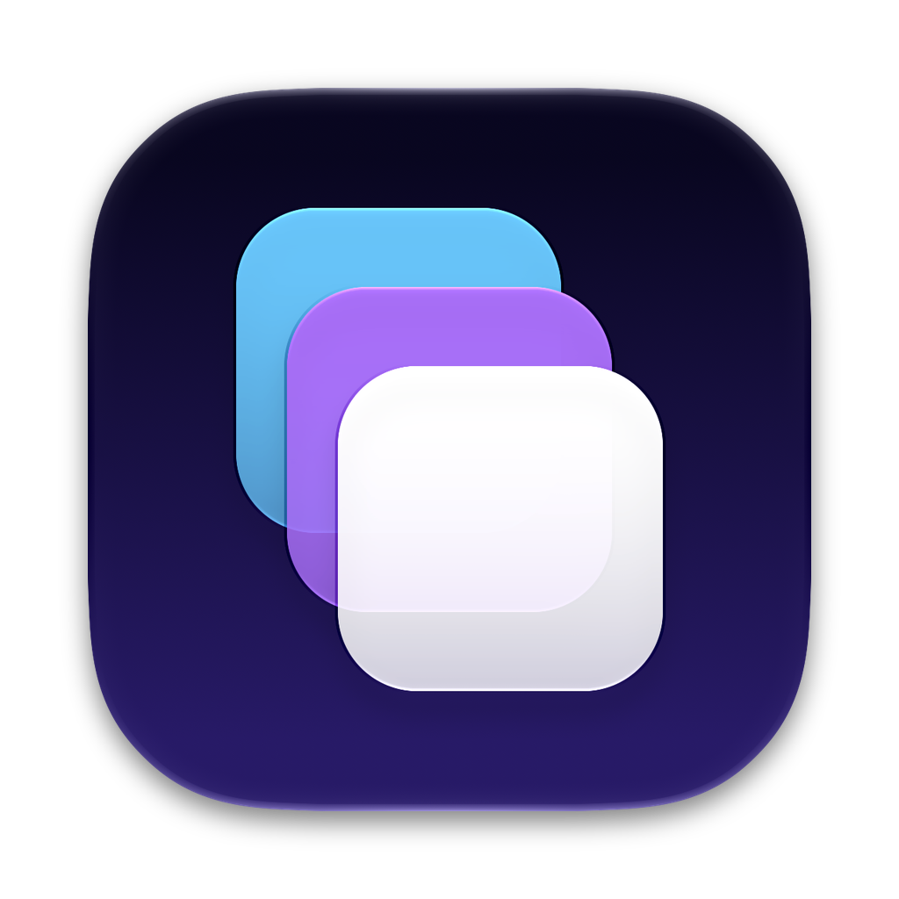
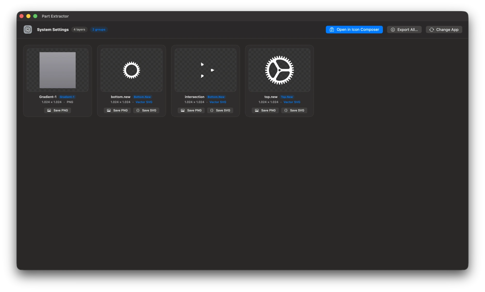
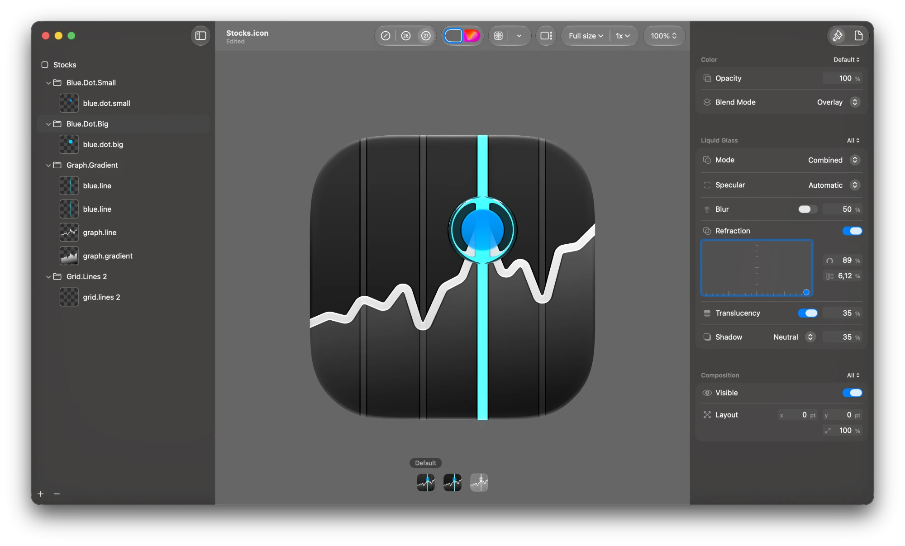

<p align="center"></p>

<h1 align="center">Icon Decompositor</h1>

<p align="center">
Pull the layers out of any macOS app's Liquid Glass icon, or open the original icon in Icon Composer and tweak it.
</p>

---

## What it does

Drop in an `.app` (or an `Assets.car`) and Icon Decompositor splits its icon into the layers the designer drew:

- **Open in Icon Composer.** The icon is rebuilt as an Apple `.icon` bundle (groups, layer order, blend modes, opacity, translucency, specular, shadows, background fill) and opened in Icon Composer, so you can start from the original and change it. Each launch works on a throwaway copy, so Icon Composer's autosaves never touch the extraction.
- **Extract the original layers.** Every layer is saved as a 1024×1024 transparent PNG, and as the original **vector SVG** where the icon uses one. Save layers one by one, drag them into Finder, copy them, or **Export All…** into a folder together with the `.icon` bundle.

<p align="center"></p>

The `.icon` it produces opens straight in Icon Composer:

<p align="center"></p>

## How it works

Icon Decompositor is a single native SwiftUI app with no runtime dependencies. It reads the icon stack from the app's asset catalog through Apple's private `CoreUI.framework` (the same code macOS uses to draw the icon) and `assetutil`, then writes the layers and an `icon.json` matching Icon Composer's schema. Apps without a layered icon fall back to their rendered icon as a single layer.

Because it relies on private API, a future macOS release can break it.

## Requirements

- macOS 13 or later
- Xcode command line tools (`swiftc`) to build
- [Icon Composer](https://developer.apple.com/icon-composer/) (ships with Xcode 26+) for the *Open in Icon Composer* button

## Build

```bash
git clone https://github.com/doraorak/IconDecompositor.git
cd IconDecompositor
./build_app.sh               # builds and installs to /Applications
./build_app.sh --no-install  # builds to ./build only
```

## Layout

| Path | What |
|---|---|
| `Sources/Decomposer.swift` | Reads the catalog, extracts layers, groups them |
| `Sources/CoreUI.swift` | Private CoreUI access (catalog lookup, SVG export) |
| `Sources/IconBundle.swift` | Writes the `.icon` bundle |
| `Sources/DecompositorViewModel.swift`, `Views.swift` | UI |
| `icon/` | The app icon, as an Icon Composer `.icon` plus its SVG layers |

## License

MIT
